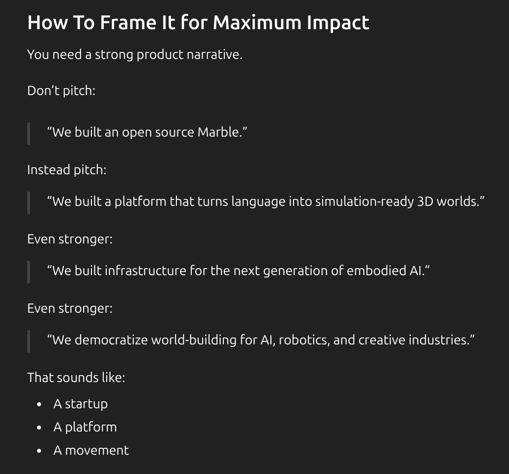

# MarbleOS

> *Imagining a World* — a spatial computing interface for turning images into explorable 3D worlds.


## Vision

MarbleOS is an experiment in what a personal spatial OS might look like if it were built around generative 3D. Upload a photo, and MarbleOS reconstructs it as a navigable Gaussian Splat — viewable, shareable, and editable right in the browser. The interface takes its aesthetic cues from visionOS: glassmorphism, depth, spring animations, and a window-based app model.

The goal is to make 3D scene generation feel as natural as taking a photo.



## Architecture

The project is organized into three layers:

```
frontend/       Next.js 16 — VisionOS-style shell + MarbleOS app
backend/        FastAPI — wraps Apple SHARP for inference
supersplat/     Gaussian Splat editor (embedded via iframe)
```

**Frontend** (`localhost:3080`) — a Next.js app built on the `vision-ui` template. The home grid launches individual apps; MarbleOS lives at `/openmarble` with Create and Gallery tabs. State is managed with Jotai atoms (`lib/marble-atoms.ts`). UI components follow the VisionOS design system: `Material`, `Ornament`, `Stack`, spring-based motion.

**Backend** (`localhost:8000`) — a FastAPI server (`backend/main.py`) that accepts an image, runs it through Apple's SHARP model, and returns a `.ply` Gaussian Splat file and a preview `.mp4`. The SHARP model lives in `Apple-Sharp-Image-to-3D-View-Synthesis/` and is imported via `sys.path` without code duplication.

**SuperSplat** (`localhost:3090`) — an open-source Gaussian Splat editor embedded as an iframe. Receives the generated `.ply` via a `?load=<url>` query parameter for in-browser 3D inspection.

### Data flow

```
User uploads image
  → POST /api/generate (FastAPI)
  → engine=sharp    → Apple SHARP (:7860)    → .ply + .mp4   (fast "3D photo")
  → engine=worldgen → WorldGen   (:7861)     → .ply          (360° explorable world)
  → SuperSplat iframe loads .ply via URL
  → Gallery tab stores and lists past generations
```

**Two generation engines** are exposed as a toggle on the Create page:

| | SHARP (default) | WorldGen |
|---|---|---|
| Result | 3D Gaussian splat valid near the input viewpoint | Full 360° explorable splat world |
| Speed (RTX 4080 SUPER) | ~15 s | ~60 s (~15 s for equirectangular input) |
| Extra input support | — | 2:1 equirectangular panoramas (auto-detected), optional text prompt |

WorldGen runs as a separate service from its own checkout — see [`worldgen/README.md`](worldgen/README.md).

## Running locally

One-time setup (keeps all caches, interpreters, and model weights on `/media/Storage` — see `.env.storage`):

```bash
source .env.storage

# SHARP inference app (uv manages Python 3.13 + torch; model downloads to $HF_HOME)
cd Apple-Sharp-Image-to-3D-View-Synthesis && uv sync && cd ..

# Backend
cd backend && uv venv .venv --python 3.12 && uv pip install -p .venv/bin/python -r requirements.txt && cd ..

# Frontend + SuperSplat (SuperSplat is built once and served by the frontend
# at /supersplat/ via the frontend/public/supersplat symlink)
cd frontend && npm install && cd ..
cd supersplat && npm install && npm run build && cd ..

# Pull binary assets (example images, sample outputs) — repo uses git LFS
git lfs pull
```

Then launch everything:

```bash
./start.sh
# SHARP Gradio app  :7860  (engine #1 — fast 3D photo)
# WorldGen service  :7861  (engine #2 — 360° explorable world, /media/Storage/WorldGen)
# FastAPI backend   :8000
# Next.js frontend  :3080  → http://localhost:3080/openmarble
```

## How to use

Once all services are up (`./start.sh`), open **http://localhost:3080/openmarble**.

### Create a world

1. Pick an input mode (top tabs): **Image** (upload a photo), **Text** (describe a scene — an
   image is generated first), **Maps** (capture a Street View location), or **URL** (extract the
   best image from any web page).
2. Pick an engine (selector below the input):
   - **3D Photo** — SHARP, ~15 s. Best for a quick "photo with depth" you view from near the
     original camera position.
   - **360° World** — WorldGen, ~1 min. Builds a fully explorable panorama world around the
     image; everything outside the original view is generated.
3. Click **Generate 3D World**. The viewer opens automatically when done; past generations live
   in the **Gallery** tab.

### 360° panoramas

Equirectangular images (2:1 aspect ratio, e.g. Ricoh Theta / Insta360 exports) are auto-detected
by the WorldGen engine and converted directly — no diffusion, ~15 s, and the whole 360° comes
from your capture instead of being generated. Just upload them like a normal image with the
**360° World** engine selected.

### API

The backend at `:8000` can be scripted directly:

```bash
# Fast 3D photo (SHARP)
curl -F "image=@photo.jpg" "http://localhost:8000/api/generate?engine=sharp&render_video=false"

# 360° world (WorldGen); 2:1 uploads are auto-treated as panoramas (override: pano=true|false)
curl -F "image=@photo.jpg" "http://localhost:8000/api/generate?engine=worldgen"

# List everything generated so far
curl http://localhost:8000/api/gallery
```

Responses include a `ply_url` you can open in the bundled viewer:
`http://localhost:3080/supersplat/index.html?load=<ply_url>`.

Generation is synchronous and the GPU handles one job at a time — expect 15 s–2 min per call.

### Notes & limits

- Inputs are capped at 2048 px on the long side (4096×2048 for panoramas) — larger uploads are
  downscaled automatically.
- WorldGen needs the gated FLUX models: accept the licenses once on your Hugging Face account
  (see [`worldgen/README.md`](worldgen/README.md)). FLUX.1-dev weights are non-commercial.
- 16 GB VRAM is enough for both engines side by side; WorldGen peaks near the full card during
  generation.

## License

This project is licensed under the **GNU Affero General Public License v3.0 (AGPL-3.0)**. See [`frontend/LICENSE.md`](frontend/LICENSE.md) for the full text.

In short: you are free to use, modify, and distribute this software, but any modified version deployed over a network must also make its source code available under the same license.

## Acknowledgements

- **[vision-ui](https://github.com/ibelick/vision-ui)** — the visionOS-inspired React component system and app shell that forms the frontend foundation.
- **[Apple SHARP](https://github.com/apple/ml-vision-view-synthesis)** — *Spatial High-fidelity Adaptive Rendering Pipeline*, Apple's model for single-image 3D Gaussian Splat reconstruction.
- **[SuperSplat](https://github.com/playcanvas/supersplat)** — the open-source Gaussian Splat editor by PlayCanvas, embedded for in-browser 3D viewing and editing.
